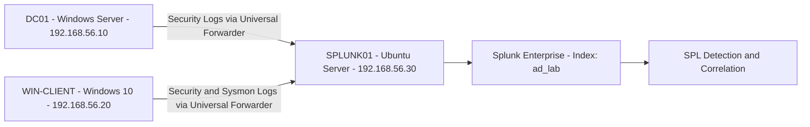

# active-directory-splunk-detection-lab
Active Directory security monitoring lab using Splunk, Sysmon and Windows auditing to detect privileged access, account creation and failed logons.


> A virtual Active Directory security lab that collects Windows and Sysmon events in Splunk to detect account creation, privilege changes, privileged logons and failed authentication attempts.

---

## Project Overview

Active Directory is a major target during cyberattacks because compromised privileged accounts can give attackers access to users, endpoints and domain resources.

In this project, I built a small enterprise-style Active Directory environment and integrated it with Splunk. Windows Security logs and Sysmon telemetry were forwarded to a centralized Splunk server, where SPL queries were used to investigate identity-related security events.

The project covers the complete detection pipeline:

**Activity Generation → Windows Auditing → Log Forwarding → Splunk Ingestion → Detection → Correlation**

---

## Objectives

- Build an Active Directory domain environment.
- Join a Windows endpoint to the domain.
- Create standard and privileged test accounts.
- Enable Advanced Audit Policy through Group Policy.
- Collect Domain Controller Security logs.
- Collect endpoint telemetry using Sysmon.
- Forward logs using Splunk Universal Forwarder.
- Detect suspicious identity and privileged-access events.
- Correlate multiple Windows Event IDs in one Splunk search.

---

## Lab Architecture



| Machine      | Purpose           | Components                                        |
| ------------ | ----------------- | ------------------------------------------------- |
| `DC01`       | Domain Controller | AD DS, DNS, users, groups and Group Policy        |
| `WIN-CLIENT` | Domain endpoint   | Windows 10, Sysmon and Splunk Universal Forwarder |
| `SPLUNK01`   | SIEM server       | Ubuntu Server and Splunk Enterprise               |

All three machines communicated through a VirtualBox Internal Network. NAT was used when internet access was required for installation.

---

## 1. Active Directory Environment

I configured `DC01` as the Domain Controller and created separate accounts for normal-user and administrative activity.

The Windows 10 client was joined to the domain, and domain-user access was verified successfully.

<!-- ORIGINAL SCREENSHOT: 7 users whoami win client -->


---

## 2. Advanced Audit Policy Configuration

A domain Group Policy Object was configured to enable auditing for account management, logon activity, privilege use and other security-sensitive operations.

<!-- ORIGINAL SCREENSHOT: 9.0 group management policy -->


The audit policy was then verified on the Windows client to confirm that the settings had been applied successfully.

<!-- ORIGINAL SCREENSHOT: 9.1 win client audit success -->


---

## 3. Splunk Configuration

A dedicated Splunk index named `ad_lab` was created to keep the Active Directory lab events separate from other data.

Splunk was configured to receive forwarded events on TCP port `9997`.

<!-- ORIGINAL SCREENSHOT: 11th ad_lab index -->


---

## 4. Windows Log Ingestion

Splunk Universal Forwarder was installed on the Windows systems to send events to the Splunk server.

### Domain Controller Security Logs

Security events from `DC01` were successfully received in Splunk.

<!-- ORIGINAL SCREENSHOT: 13 dc01 sec logs -->


### Windows Client Sysmon Logs

Sysmon telemetry from `WIN-CLIENT` was also received successfully.

<!-- ORIGINAL SCREENSHOT: 14 winclient sysmon logs -->


The following SPL query was used to verify ingestion:

```spl
index=ad_lab
| stats count by host source sourcetype
```

---

## Detection Coverage

| Event ID | Security Activity            | Detection Value                                              |
| -------: | ---------------------------- | ------------------------------------------------------------ |
|   `4624` | Successful logon             | Identifies successful access to a system                     |
|   `4625` | Failed logon                 | Detects invalid credentials and possible password attacks    |
|   `4672` | Special privileges assigned  | Identifies accounts receiving administrator-level privileges |
|   `4720` | User account created         | Detects new domain accounts                                  |
|   `4728` | Member added to global group | Detects changes to privileged domain groups                  |
|   `4732` | Member added to local group  | Detects changes to privileged local groups                   |

---

## 5. Account Creation Detection — Event ID 4720

A controlled test account was created in Active Directory to generate Event ID `4720`.

<!-- ORIGINAL SCREENSHOT: 15.1 account creation -->


The resulting event was successfully detected in Splunk.

```spl
index=ad_lab host=DC01 EventCode=4720
| table _time SubjectUserName TargetUserName host
| sort - _time
```

<!-- ORIGINAL SCREENSHOT: 15 splunk result for 4720 -->


This detection helps identify unauthorized or unexpected account creation inside a domain.

---

## 6. Privileged Access Test

Administrative privileges were assigned to a controlled lab account to generate privileged account activity.

<!-- ORIGINAL SCREENSHOT: 16 giving privilege to lab.admin -->


This demonstrates how privilege changes can be generated safely and then investigated through centralized Windows logs.

---

## 7. Special Privilege Detection — Event ID 4672

Windows generates Event ID `4672` when sensitive privileges are assigned during a logon session.

```spl
index=ad_lab host=DC01 EventCode=4672
| table _time SubjectUserName Account_Name Logon_ID host
| sort - _time
```

<!-- ORIGINAL SCREENSHOT: 17 detection 3 special privilege -->


This event is useful for monitoring administrative logons. It is not automatically malicious, but it becomes important when the account, system or login time is unexpected.

---

## 8. Failed Logon Detection — Event ID 4625

An invalid-password attempt was performed using a lab account to generate Event ID `4625`.

```spl
index=ad_lab EventCode=4625
| table _time host Account_Name IpAddress Failure_Reason
| sort - _time
```

<!-- ORIGINAL SCREENSHOT: 18 detection 4 failed login -->


Repeated failed-logon events may indicate:

* Incorrect credentials
* Password guessing
* Brute-force activity
* Unauthorized access attempts
* A misconfigured service or scheduled task

---

## 9. Active Directory Security Correlation

Instead of investigating every Event ID separately, I created a single SPL query that categorizes important identity-security events.

```spl
index=ad_lab host=DC01
(EventCode=4728 OR EventCode=4732 OR EventCode=4672
OR EventCode=4624 OR EventCode=4625 OR EventCode=4720)

| eval category=case(
    EventCode=4728 OR EventCode=4732, "Group Membership Change",
    EventCode=4672, "Special Privileges",
    EventCode=4624, "Successful Logon",
    EventCode=4625, "Failed Logon",
    EventCode=4720, "User Created",
    true(), "Other"
)

| table _time EventCode category SubjectUserName TargetUserName
MemberName GroupName IpAddress host

| sort - _time
```

<!-- ORIGINAL SCREENSHOT: 19 splunk ad security correlation -->


The correlation search provides a compact timeline of:

* Successful and failed logons
* New user creation
* Special privilege assignment
* Group membership changes

This makes the results easier for a SOC analyst to review and investigate.

---

## Implementation Workflow

1. Created three virtual machines in VirtualBox.
2. Configured an isolated internal network.
3. Installed Active Directory Domain Services on `DC01`.
4. Promoted `DC01` to a Domain Controller.
5. Created organizational units and domain accounts.
6. Joined `WIN-CLIENT` to the domain.
7. Configured Advanced Audit Policy using Group Policy.
8. Installed Sysmon on the Windows endpoint.
9. Installed Splunk Enterprise on the Ubuntu server.
10. Created the `ad_lab` Splunk index.
11. Enabled Splunk receiving on port `9997`.
12. Installed Splunk Universal Forwarder on Windows.
13. Forwarded Security and Sysmon logs to Splunk.
14. Generated safe identity-related test activity.
15. Built and validated SPL detection queries.
16. Created a combined Active Directory correlation search.

---

## Key Learning

This project taught me that security detection is not limited to writing a Splunk query.

A reliable detection pipeline requires:

* Correct audit-policy configuration
* Consistent endpoint telemetry
* Stable network connectivity
* Proper log forwarding
* Relevant field extraction
* Controlled event generation
* Validation of every detection result

By implementing the complete pipeline, I learned how an action performed in Active Directory becomes a Windows security event, travels through the forwarding infrastructure and finally appears as searchable SOC evidence inside Splunk.

---


## Ethical Use

All testing was performed in a private and isolated virtual lab using controlled test accounts and systems owned by the project author.

This repository is intended only for defensive cybersecurity learning and authorized security testing.

---

## Author

**Sarthaki Shinde**

Computer Engineering Student | Cybersecurity | SOC & Blue Team

```
```
